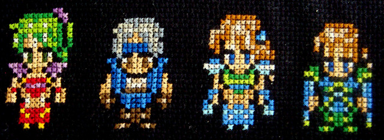

FF6 が Android で出ているのでやった。

普段ゲームをやらない僕としては RPG に手を出すのは珍しい。というかもう RPG を一本
やる元気と気力と時間がなく途中でやめる気がしていたのだけどなんとかエンディングま
では見ることができた。学生時代にも FF8 と FF10 を途中までやって飽きて放置してい
るのである。これらはたぶん二度とやることはない。

僕にとっての Final Fantasy とは FF7 で、小学生の頃兄がどこかから借りてきてやって
いたのを後ろから見ていた記憶がある。その後自分でもやるようになり、ハマった。次に
やったのは FF9 だった。まともにやった FF はこの2作だ。どちらかというとシステムは
7 のほうが好きで、ストーリーは 9 のほうが好きだった。「自分、自分て言いながら、
自分のねえ奴だな……」というセリフは強烈に記憶に残っている。

で、 FF6 である。最初はシステムがわからないがやっているうちにのめり込んで来ると
いうのは RPG というジャンルの特徴のように思う。魔石システムは FF7 のマテリアに慣
れていたためかすんなり理解した。ただ最後までいっても結局主人公が誰なのかわからな
いし、なぜ仲間になったのかわからないキャラも多かった。これ自分が見ていないストー
リーがたくさんあるからだろうか。それにしても仲間が最終的に 14 人て多すぎでは。

操作は最後まで慣れなかった。 Android 版では当然カーソルキーなどないので、タッチ
した点から動かした方向がカーソルキーに相当する操作になる。しかし最後まで思わぬ方
向に行くという事態はなくならなかった。絶対的な位置にないは難しい。しかし普段 Mac
のトラックパッドを使っていて不便に感じたことはないし、不思議なものだ。と書いてゲ
ーム内ではカーソル操作の方向が8種類に限定されていたことによるのだろう、と気づい
た。 Mac やノート PC のトラックパッドは実質無段階で方向調節でき微妙な調節ができ
るため不便には感じないのだろう。

いずれにしろここ数日は FF6 を飽きる前にやってしまわねば、という妙な脅迫感と戦っ
ていた。エンディングまでは見たので自分の中ではとりあえず満足である。
